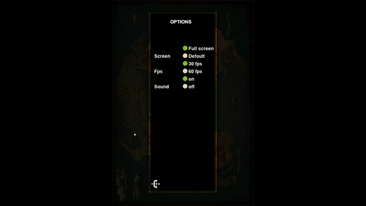

    
        
    

 

<h1 align="center">
    The Hero's Journey  v.2.1
</h1>

    
    

## About

This is my first personal project \o/

I started this game to practice programming, I chose to make this game because it would be fun and also a challenge.

It's in the first version, I'll add and refine it over time, but for now you can download and play. (Soon I will share the executable on google drive.)

The Hero's Journey is a turn-based rpg, and its plot takes place on a continent in chaos between factions, kingdoms, races and even worlds.

### The current scope:

<li>
Choose from three ethnicities of Elves
</li>
<li>
Choose from three classes according to your chosen ethnicity
</li>
<li>
Create and Delete characters (up to 9 characters saved)
</li>
<li>
Level progression system
</li>
<li>
55 areas to venture into and battle with region-specific opponents.
</li>
<li>
Battle system (Attack, Defend and Evade)
</li>
<li>
Battle Status System (Dodge, Block, Critical)
</li>
<li>
Intuitive battle log
</li>

You can watch the video on [Youtube](https://www.youtube.com/watch?v=v-M-O1niVuk)

 

## Menu

When starting the Game you have the following options:
<li>
    New game
</li>
<li>
    Load game
</li>
<li>
    Credits
</li>
<li>
    Configuration
</li>
<li>
    Quit
</li>

 

### Basic system settings:
<li>
    Standard screen 747 x 1050 or Full Screen
</li>
<li>
    Increase game speed from 30 FPS to 60 FPS
</li>
<li>
    Mute
</li>

 

     
    
    

 

## Create and Load the Character

The game allows a maximum of 9 save games

### When creating a new game:
<li>
    Each elf ethnicity has its history and characteristics.
</li>
<li>
    Each ethnicity has three classes
</li>
<li>
    Each class has unique abilities.
</li>

 

    
    
    

 

## Exploring the World

The game currently has 55 areas

Each area has an average of 10 unique opponents with randomly generated stats

### The battle system:
<li>
    Basic Actions (Attack, Defend, Evade)
</li>
<li>
    Intuitive battle log
</li>
<li>
    Stamina consumption for stocks
</li>
<li>
    Automatic health, energy and stamina regeneration
</li>

 

    
    
    

 

## Credits

All opponent and character sprites are authored by the
[Oryx Design Lab](https://www.oryxdesignlab.com/home)

The game map is authored by
[Rarameth](https://www.deviantart.com/rarameth/art/Terras-Novas-Arkan-Mapa-para-RPG-de-mesa-659378593)

 

## License

License - MIT

You can reuse this project, remember that Oryx Design Lab sprites and Rarameth map have not been licensed for commercial purposes, this project is for study purposes only.