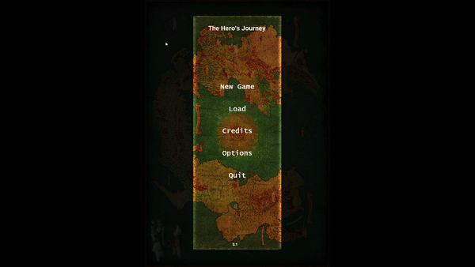
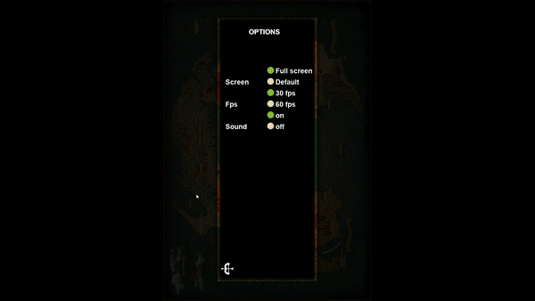

    
        
    

<h1 align="center">The Hero's Journey  v.2.1</h1>

    
    
         

     
    
    
 

    
    
    
 

    
    
    
 

## Description
Personal project using Python/Pygame to create rpg/turns game.
You can watch the video on [Youtube](https://www.youtube.com/watch?v=v-M-O1niVuk)

This is my first personal project in the programming area, I love games and to train, I decided to try creating this game.

## It's the first step of three.

Version 1.0:
Create menu / Create new character based on ethnicity and class options / Allow loading or deleting character / Choose fps, sound and screen options.

Version 2.0:
Load the character for gameplay / Systems of: battle, location on the map generating new opponents / Status interface, weapon proficiency for physical characters and element for mages

Version 3.0:
Systems: Inventory, Equipment, Market / Infinite Game Progression and Opponents AI Progression.

## Built with

1 - [Python 3.10.5](https://www.python.org/downloads/release/python-3105/)

2 - [Pygame 2.1.2](https://pypi.org/project/pygame/)
