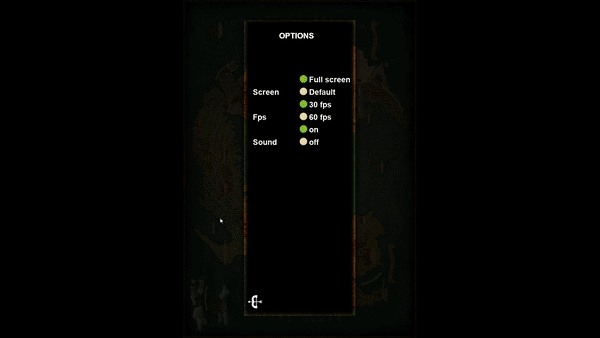

<div align="center">
    
    
</div>

<br>

<h1 align="center">
    The Hero's Journey  v.3.0
</h1>

<div align="center">
    
    
</div>

<br>

> ***This is my first project with programming, so the code doesn't follow the best organization and object orientation practices.***

- [About](#about)
- [The current scope:](#the-current-scope)
- [Menu](#menu)
- [Create and Load the Character](#create-and-load-the-character)
- [Exploring the World](#exploring-the-world)
- [Dependencies](#dependencies)
- [Run game](#run-game)
- [Structure](#structure)
- [Credits](#credits)
- [License](#license)

> [Tasks](tasks.md)

## About

This is my first personal project \o/

I started this game to practice programming, I chose to make this game because it would be fun and also a challenge.

It's in the first version, I'll add and refine it over time, but for now you can download and play. (Soon I will share the executable on google drive.)

The Hero's Journey is a turn-based rpg, and its plot takes place on a continent in chaos between factions, kingdoms, races and even worlds.

## The current scope:

- Choose from three ethnicities of Elves
- Choose from three classes according to your chosen ethnicity
- Create and Delete characters (up to 9 characters saved)
- Level progression system
- 55 areas to venture into and battle with region-specific opponents.
- Battle system (Attack, Defend and Evade)
- Battle Status System (Dodge, Block, Critical)
- Intuitive battle log

> - You can watch it here - [Youtube - Menu](https://youtu.be/v-M-O1niVuk)
> - You can watch it here - [Youtube - Game](https://youtu.be/LTYqAjMrrDI)

## Menu

When starting the Game you have the following options:

- New game
- Load game
- Credits
- Configuration
- Quit

Basic system settings:

- Standard screen 747 x 1050 or Full Screen
- Increase game speed from 30 FPS to 60 FPS
- Mute

<div align="center">
    
    
    
</div>

## Create and Load the Character

The game allows a maximum of 9 save games

When creating a new game:

- Each elf ethnicity has its history and characteristics.
- Each ethnicity has three classes
- Each class has unique abilities.

<div align="center">
    
    
    
</div>

## Exploring the World

The game currently has 55 areas

Each area has an average of 10 unique opponents with randomly generated stats

The battle system:

- Basic Actions (Attack, Defend, Evade)
- Intuitive battle log
- Stamina consumption for stocks
- Automatic health, energy and stamina regeneration

<div align="center">
    
    
    
</div>

## Dependencies

- Git
- Python
- Pip
- Virtualenv -> Optional
- IDE -> Recommend vsCode

## Run game

Clone this project

Open your terminal

```sh
git clone https://github.com/Fernando-Medeiros/The-Hero-Journey.git
```

Access the project folder

```sh
cd The-Hero-Journey
```

Create the virtual environment

```sh
virtualenv .venv

# or
python3 -m venv .venv
```

Activate .venv

```sh
# Linux
source .venv/bin/activate

# Windows
./.venv/bin/activate.ps1
```

Install dependencies

```sh
pip install -r requirements.txt
```

Start the game

```sh
python3 main.py
```

> Some modules are necessary for Linux users.

## Structure

```console
.
├── app
│   ├── battle
│   │   ├── battle.py
│   │   ├── log.py
│   │   ├── skills.py
│   │   └── view.py
│   ├── character
│   │   ├── character.py
│   │   ├── model.py
│   │   ├── settings
│   │   │   ├── classe_progression.json
│   │   │   ├── classes.json
│   │   │   ├── settings.py
│   │   │   └── skills.json
│   │   └── view.py
│   ├── database
│   │   ├── base.py
│   │   ├── character_db.py
│   │   ├── db
│   │   │   ├── characters.json
│   │   │   ├── enemies.json
│   │   │   └── maps.json
│   │   ├── enemy_db.py
│   │   └── map_db.py
│   ├── events.py
│   ├── game.py
│   ├── menu
│   │   ├── load.py
│   │   ├── menu.py
│   │   ├── newgame.py
│   │   ├── options.py
│   │   └── settings.py
│   ├── opponent
│   │   ├── enemy.py
│   │   ├── model.py
│   │   └── view.py
│   ├── sound.py
│   └── tools.py
├── docs
│   ├── img
│   ├── log.txt
│   ├── README.md
│   └── tasks.md
├── LICENSE
├── main.py
├── paths.py
├── requirements.txt
├── runtime.txt
└── static
    ├── context_info
    │   ├── dark
    │   │   ├── assassin.txt
    │   │   ├── duelist.txt
    │   │   ├── heraldry.txt
    │   │   └── mage.txt
    │   ├── forest
    │   │   ├── heraldry.txt
    │   │   ├── mage.txt
    │   │   ├── warden.txt
    │   │   └── warrior.txt
    │   └── grey
    │       ├── heraldry.txt
    │       ├── mage.txt
    │       ├── warden.txt
    │       └── warrior.txt
    ├── images
    │   ├── classes
    │   ├── enemies
    │   ├── game
    │   ├── menu
    │   │   ├── load
    │   │   ├── newgame
    │   │   └── options
    │   └── sprites_credits.txt
    ├── sound
    └── soundtrack
        └── (97) Orpheus Odyssey - Legends on Strings - YouTube.url
```

## Credits

All opponent and character sprites are authored by the
[Oryx Design Lab](https://www.oryxdesignlab.com/home)

The game map is authored by
[Rarameth](https://www.deviantart.com/rarameth/art/Terras-Novas-Arkan-Mapa-para-RPG-de-mesa-659378593)

## License

License - MIT

You can reuse this project, remember that Oryx Design Lab sprites and Rarameth map have not been licensed for commercial purposes, this project is for study purposes only.
